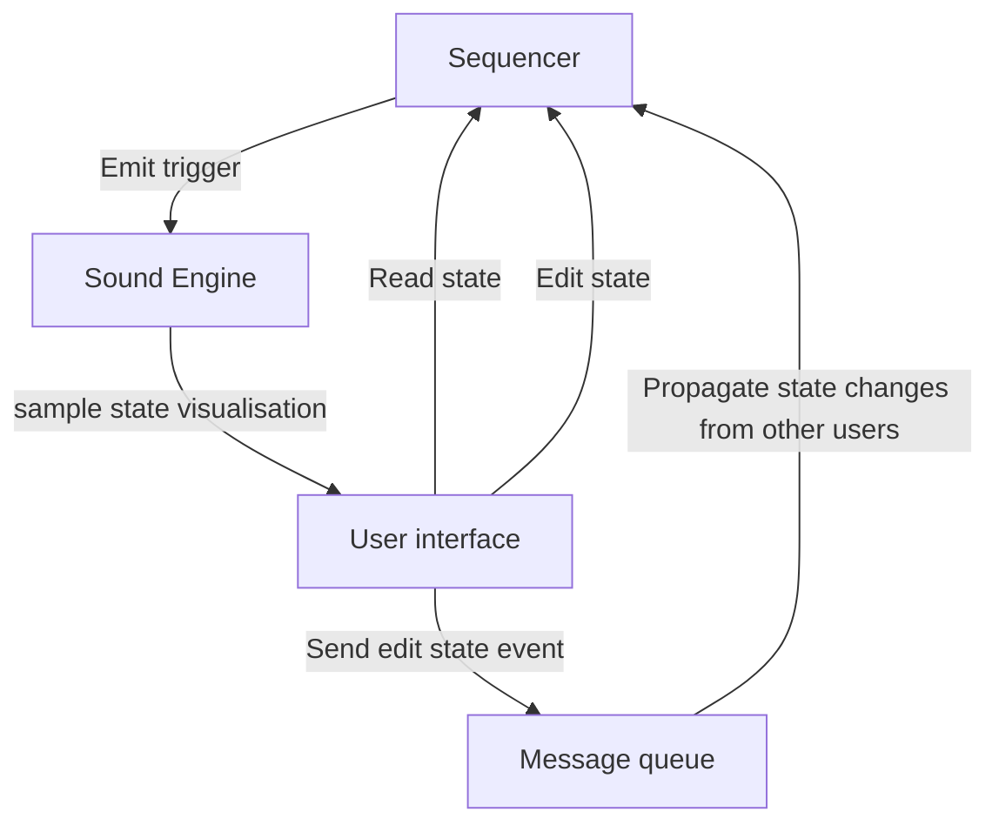

# Libretakt

Project name based on Elektron's [Digitakt](https://www.elektron.se/us/digitakt-explorer) (but free/libre/etc).

## Learning resources

- Audio playback - [Rodio](https://github.com/RustAudio/rodio)
- UI - [MacroQuad](https://macroquad.rs/)

