## 🚧🚧 **Under (re)construction** 🚧🚧

After writing the initial version of LibreTakt for a university project, I've
decided to rewrite it for a slightly different use case. The new version will be structured as follows:

- a single synthesis/sampling engine running locally on a PC/laptop
- multiple remote controllers running as a web app, based on WebAssembly and
  [egui](https://egui.rs), connected via local network

For the previous final stage of the project, check the [1.0.0
tag](https://github.com/Wint3rmute/libretakt/tags).

# Libretakt

An open-source standalone software sampler, allowing for collaborative music creation over the network & streaming your performance via an internet radio.

Workflow and project name inspired by Elektron's [Digitakt](https://www.elektron.se/us/digitakt-explorer).

**You can listen to a demo [here](https://odysee.com/@Wint3rmute:c/libretakt_demo:2)**

## Features

- 4 voice polyphony
- Elektron-style parameter locking
- Every voice gets a separate:
  - Animated cat
  - Amp ADSR
  - Filter ADSR
  - Delay effect with adjustable send, feedback & length
  - Reverb effect with adjustable send, size & early mix
  - [TODO] an LFO
- [TODO] a master compressor

## Running

1. `cargo run` - default sampler UI with audio engine, no synchronisation server.
2. `LIBRETAKT_SERVER=ws://70.34.252
.191:8081/3f33ef73-4104-4c84-a826-11336ee24d65 cargo run --release --features enable_synchronisation` - same as above, synchronisation enabled. **Remember to start the server first**.
3. `cargo run -p server` - starts the synchronisation server.
4. `cargo run --example headless_ffmpeg_client | ffmpeg -f f32le -i pipe: -f mp3 - | ffmpeg -re -f mp3 -i pipe: -c copy -f flv rtmp://baczek.me/live/livestream` - Headless streaming client. Again, **remember to start the server first**
5. For windows `$env:LIBRETAKT_SERVER = "ws://70.34.252.191:8081/3f33ef73-4104-4c84-a826-11336ee24d65"`
6. `cp project.json C:\\Users\\mateu\\AppData\\Local\\Temp\\project.json`
7. http://70.34.252.191:8080/players/srs_player.html?autostart=true&stream=livestream.flv&port=8080&schema=http

---

Note: below are the notes collected during development and some diagrams we made for the university course.
Most of it is messy, some notes are in polish :)

## Learning resources used during development

- Audio playback - [Rodio](https://github.com/RustAudio/rodio)
- UI - [MacroQuad](https://macroquad.rs/)
- Music genre classification:
  - [python tools overview](https://farranaanjum05.medium.com/music-genre-classification-with-python-51bff77adfd6)
  - [GTZAN dataset](https://www.kaggle.com/datasets/andradaolteanu/gtzan-dataset-music-genre-classification)
- On mutexes and audio processing - [using locks in real-time audio processing](Using locks in real-time audio processing, safely)

## Component diagram

## Class diagram

## Gantt

```mermaid
gantt
    title Rozkład jazduni
    dateFormat  YYYY-MM-DD

    section Web
    POC serwer websocket    :w1, 2022-10-15, 7d
    POC serializacja&deserializacja Cap'n'Proto  : 2022-10-15, 7d
    Testy synchronizacji stanu za pomocą Cap'n'Proto  : 7d

    section Logika biznesowa
    Mechanizm synchronizacji stanu :crit, 2022-10-15, 7d
    Zapisywanie stanu sequencera: 7d
    Blockowanie ścieżek na jednego użytkownika: 7d

    section UI
    Widgety z wizualizacją parametrów   :crit, 2022-10-15, 7d
    Podpięcie sequencera do widgetów   :crit, 7d
    Podgląd i edycja sekwencji : 7d
    Obsługa parameter locks : 7d
    Obsługa przełączania ścieżek i patternów : 7d

    section DSP&Sequencing
    Filtry na audio :2022-10-15, 7d
    Efekty reverb + delay : 7d
    (AMP + Filter) ADSR: 7d
```

## Do rozpisania

1. Wymagania funkcjonalne i niefunkcjnalne:
  - Zdefiniowanie czemu dana technologia została wybrana ("najlepiej spełnia wymagania XXX ponieważ YYY")
2. Zamodelowanie procesów oddziaływania użytkownika z systemem
3. Opis komunikacji między komponentami w systemie
4. Rozmieszczenie komponentw systemu

### Gotowy plan raportu z wykładu xd

#### Wstęp

1. Opis rzeczywistości, w której funkcjonuje system
2. Opis klas obiektów występujących w rzeczywistości (modelowanie)
3. Opis atrybutów tychże klas
4. Opis relacji

#### Opis zadań

1. Diagram przypadków użycia
2. Flow chart
3. Sequence diagram

#### Opis procesów

"Proces biznesowy" - opisanie jakie procesy realizuje aplikacja z perspektywy użytkownika

#### Opis wymiany komunikatów

Mówił o tym tak, jakby było dla niego ważne.

1. Opis/definicja wiadomości
2. Opis sekwencji wysyłania wiadomości

#### Opis rozmieszczenia komponentów

VPS/VM/Dockerki, inne takie

## Old diagram

