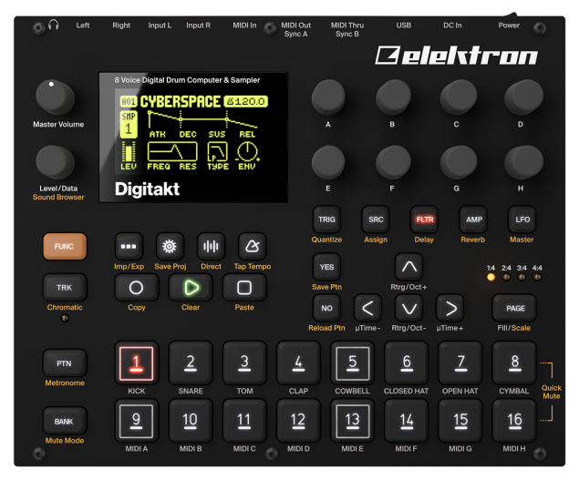
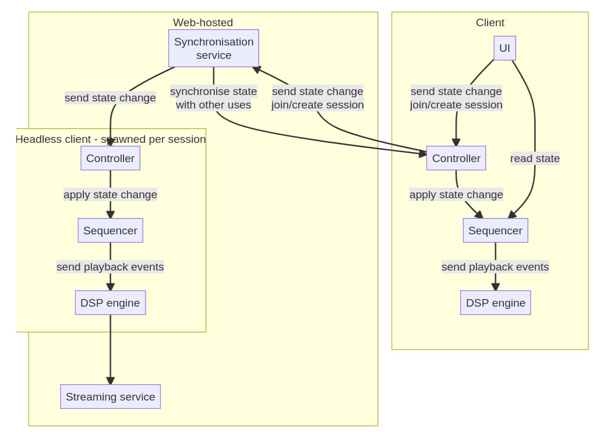

# Prezentacja 1 - cel i opis projektu

**`Libretakt`** - kolaboratywne środowisko do tworzenia muzyki.

- Michał Rajkowski
- Konrad Gmyrek
- Adam Cierniak
- Mateusz Bączek


# Libretakt - wstęp teoretyczny

{ width=200px }

- odtwarzanie cyfrowych sampli,
- zmiana prędkości i kierunku odtwarzania, *loopowanie*
- nakładanie efektów na dźwięk,
- rytmiczna modulacja parametrów odtwarzania.


# Wymagania funkcjonalne

1. Możliwość tworzenia "jam session" przez użytkowników,
2. kolaboratywna interakcja z samplerem
3. kompensacja opóźnień między użytkownikami - synchronizacja metrum,
4. synteza/mixowanie tworzonego utworu:
    - w chmurze, stream do użytkowników,
    - lokalnie, aby osiągnąć minimalną latencję.


# Stos technologiczny

1. Docker - łatwy deployment na dowolnym serwerze Linuxowym,
2. Rust - synteza i przetwarzanie dźwięku wymagają wydajności obliczeniowej,
3. Message queue (Kafka lub prosta własna implementacja) - komunikacja w czasie rzeczywistym, skalowanie "workerów" generujących i streamujących audio na wiele maszyn.

# Diagram komponentów



<!-- # Odtwarzanie/synteza dźwięku - PCM -->

<!-- {width=150px} -->

<!-- {width=150px} -->

<!-- Źródło: dokumentacja projektu [ALSA](https://www.alsa-project.org/alsa-doc/alsa-lib/pcm.html) -->


<!-- # Co wpływa na jakość dźwięku (i zużycie zasobów) podczas odtwarzania: -->

<!-- - Sampling rate - jak często generowana jest kolejna próbka -->
<!-- - Bit depth - z jaką dokładnością zapisujemy próbki -->

<!-- # Niskopoziomowy dostęp do karty dźwiękowej za pośrednictwem systemu operacyjnego -->

<!-- - Linux - `ALSA`/`PulseAudio` -->
<!-- - Android - `AAudio`/`OpenSL ES` -->
<!-- - MacOS/IOS - `CoreAudio` -->
<!-- - Aplikacje do produkcji muzyki - standard `VST`/`CLAP` -->


<!-- # Test Podświetlania Syntaxu Rust -->

<!-- ```rust -->
<!-- fn main() { -->
<!--     println!("Hello world"); -->
<!-- } -->
<!-- ``` -->

